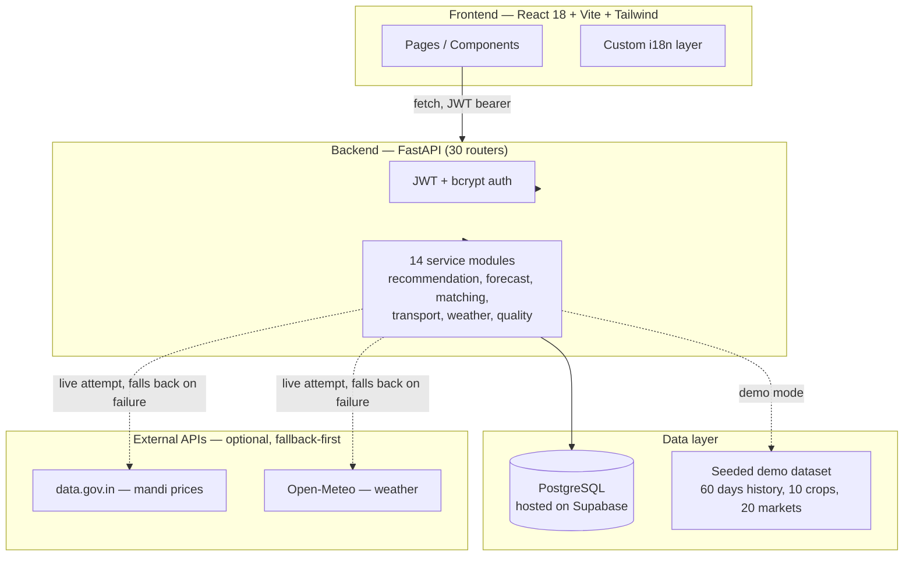

# CropWise

A decision-support platform for individual farmers — comparing markets, computing real net profit after transport, and connecting farmers directly with verified buyers — built for SIH 2026 Problem Statement PS-26132.

**Live app:** https://cropwise-alpha.vercel.app · **API:** https://cropwise-backend-o21s.onrender.com

> The backend runs on Render's free tier and may take 30–60s to wake up on first request after idling — if the live demo seems stuck, give it a minute and retry.

---

## Overview

CropWise is a full-stack web platform that helps a smallholder or mid-sized farmer answer one question: *given my crop, quantity, and location, where should I actually sell, and what will I actually net after costs?* Existing tools (eNAM, AGMARKNET, most private agritech apps) either publish a price or move produce at scale — none combine transparent net-realization math, explainable selling recommendations, and a verified farmer-to-buyer marketplace in one connected system aimed at a single farmer's decision.

CropWise's decision-support logic — the recommendation engine, price forecaster, buyer matcher, and quality grader — is **deliberately rule-based and statistical, not machine learning**. This is a stated design choice (explainability over black-box accuracy for a first-time, possibly low-literacy user), not a placeholder for AI that didn't get built. Every number and recommendation on screen traces back to a visible, human-readable reason.

## Problem

- **Price uncertainty**: mandi prices vary market-to-market and farmers rarely see more than one.
- **No net-profit visibility**: a higher sticker price at a distant market can be a worse deal once transport is priced in — almost nothing shows this.
- **Fragmented buyer access**: farmers sell to whoever shows up, not necessarily the best available buyer.
- **Language/literacy barriers**: most digital-agriculture tools are English/Hindi-only text interfaces.

## Solution

CropWise pulls together market comparison, real transport-cost modelling, an explainable sell-now-vs-hold recommendation, a verified marketplace, buyer matching, shared-transport pooling, and a multilingual text/voice assistant — all working against the same underlying data, not parallel copies of the same logic.

## Why CropWise

| Traditional way | CropWise |
|---|---|
| Shows only the market price | Shows your expected net profit after transport and costs |
| One market, no comparison | Compares nearby markets automatically |
| No buyer visibility | Matches you with verified, ranked buyers |
| No explanation | Every recommendation shows its contributing factors |

## Core Features

- **Market Intelligence** — compare nearby markets on price, distance, and estimated transport, with an explicit **LIVE vs DEMO** label on every price shown (see [Market Data](#market-data)).
- **Net Realization / Profit Calculator** — real transport, labour, packaging, and storage costs subtracted from revenue, side-by-side across selling options.
- **AgriAdvisor** — an explainable sell-now-vs-hold recommendation with five visible contributing factors (demand, supply, weather risk, transport cost, price trend).
- **Price Forecast** — a 7-day trend-and-volatility statistical forecast with a visible confidence score and a genuine backtested accuracy (walk-forward MAE/RMSE/MAPE against real historical data).
- **Ask AgriAdvisor** — a multilingual, rule-based assistant that answers market/price/transport/buyer questions in natural language, backed by the same services every dedicated page uses.
- **AgriMarket (Marketplace)** — post lots, receive and rank buyer offers, accept/reject with server-side validation.
- **Smart Buyer Matching** — explainable multi-factor scoring (price, reliability, distance, quantity fit, verification) for every candidate buyer.
- **Buyer Demands & Verification** — buyers post demand signals; buyer accounts go through a submit/review/approve verification workflow with an audit log.
- **Transport & Transporter Marketplace** — real quote/counter-offer/agree negotiation between farmers and transporters, with status tracked to delivery.
- **FarmPool** — split shared-truck transport cost with nearby farmers (see honest caveat under [FarmPool / Group Selling](#farmpool--group-selling)).
- **Group Selling** — real, persisted cooperative-selling pools.
- **Storage Marketplace** — browse and book storage facilities (currently demo facilities, real booking flow).
- **Multilingual + Voice** — 15-language architecture; see the [honest coverage numbers](#multilingual--i18n) below rather than assuming uniform completeness.
- **Admin Dashboard** — live-computed platform metrics and privacy-conscious login-activity tracking.
- **Quality Assessment** — real analysis of an uploaded produce photo's actual pixels (heuristic, not a trained model).

## How It Works

```
Add Produce → Market Analysis → Find Buyer → Create & Ship → Payment Received
```

## Core Decision Flow

```
Crop + Quantity + Location
        │
        ▼
  Market Data (live-attempted, demo-labelled fallback)
        │
        ▼
  Market Comparison across nearby markets
        │
        ▼
  Transport Cost (vehicle/fuel/toll model)
        │
        ▼
  Net Realization per market option
        │
        ▼
  Recommendation (rule-based, explainable) ──► Buyer Match ──► Transaction
```

## Architecture



**Note on Supabase**: Supabase is used here strictly as managed PostgreSQL hosting via SQLAlchemy — there is no Supabase Auth, no Supabase client SDK, no Row Level Security policies in this repository, and no Storage/Realtime usage. If you're evaluating this as a "Supabase project," it's more accurately "a Postgres project that happens to be hosted on Supabase."

## Tech Stack

**Frontend**: React 18, Vite 5, Tailwind CSS, React Router, Recharts, lucide-react
**Backend**: FastAPI, SQLAlchemy 2.0, Pydantic v2, `python-jose` (JWT), `passlib`/`bcrypt`, `httpx`
**Database**: PostgreSQL (Supabase-hosted)
**Testing**: `pytest` — 22 files, 197 passing / 6 skipped at time of this audit
**Deployment**: Frontend on Vercel, backend on Render

## Database & Supabase

- 28 SQLAlchemy models covering farmers, buyers, listings, lots, offers, transactions, payments, receipts, transport (requests/offers/messages/reviews), storage, grievances, ratings, notifications, group-selling pools, buyer verification (+ audit log), and login events.
- **No SQLite fallback** — `DATABASE_URL` must point at a real Postgres instance or the backend refuses to start.
- Schema evolution is additive-only: `Base.metadata.create_all()` on startup plus a hand-written migration function that only ever adds tables/nullable columns, never drops or rewrites data. There's no Alembic and no `.sql` migration files in this repo.
- `login_events` is deliberately minimal by design — never stores a password, hash, token, API key, IP, or the raw email typed, only user id (if matched), role, timestamp, and success/failure.

## Market Data

Market prices are served through a layered pipeline, labelled honestly at every step:

1. **Live attempt** against data.gov.in (two resources: market-specific, then district-aggregate) — requires `DATA_GOV_IN_API_KEY` and `MARKET_DATA_SOURCE=live`.
2. **Demo dataset** — 60 days of seeded historical prices per crop/market, used whenever live mode isn't configured, times out, errors, or has no record for that exact selection.

The API and UI distinguish `status: ok / no_records / error` — a government "no record for this selection" is never silently replaced with a demo number presented as live. **As of this audit, a real successful live fetch has not been directly observed** (development happened in a network-restricted sandbox) — the client code is written to the documented API contract and covered by mocked-response tests, but treat "live data.gov.in" as implemented-but-field-unverified until you confirm it against a deployed instance with real internet access.

## Recommendation / Intelligence

**None of CropWise's decision-support components are machine learning.** This is intentional — see [Core Features](#core-features). Specifically:

| Component | Method |
|---|---|
| AgriAdvisor recommendation | Deterministic rules over demand/supply ratio, weather risk, price trend, transport-cost ratio |
| Price forecast | Least-squares trend regression + volatility confidence band, with real walk-forward backtesting |
| Buyer matching | Weighted deterministic scoring across 7 factors |
| Quality grading | Heuristic pixel/color-distribution analysis of the real uploaded image |
| Weather risk | Real Open-Meteo live attempt, deterministic seeded fallback (not random) |
| Assistant NLU | Keyword/pattern intent classification + rule-based entity extraction |

A trained model (Prophet/XGBoost/LSTM for forecasting, a CNN for quality grading) could be dropped in behind these same interfaces without an API/frontend rewrite — that swap has not happened yet.

## Marketplace

Real, server-validated CRUD: listings/lots, buyer offers, accept/reject with duplicate-action prevention, quantity/price validation against the listing's minimums. Buyer verification is a real submit → admin review → approve/reject workflow with an audit log, not a badge you can self-assign.

## Transport / Net Realization

Transport cost is modelled per trip: vehicle-class selection (mini pickup / LCV / medium truck), diesel price, driver cost, maintenance, vehicle overhead, tolls beyond a free radius, an empty return leg, and a minimum-trip floor — all labelled as tunable reference assumptions, not official tariffs. This is the *same* calculator used everywhere a transport figure appears (market comparison, buyer matching, AgriAdvisor, profit calculator, FarmPool, admin impact dashboard) — there is no second copy of this logic anywhere in the codebase.

## FarmPool / Group Selling

These are two different things, worth not conflating:

- **FarmPool** (`/logistics/farmpool`) is a stateless calculator: it computes a real shared-cost split (using a real negotiated transporter price when one is linked, otherwise the transport estimate above), but the *other farmers* shown pooling with you are seeded/simulated profiles, not real matched users. The API returns `pool_partners_are_simulated: true` and the UI shows "Demo data — nearby farmer profiles shown here are simulated."
- **Group Selling** (`/group-selling`) is a real, persisted `GroupSellingPool`/membership table. Its displayed "estimated price improvement %" is a simple formula off member count and pooled quantity, not a market-derived figure.

## Multilingual / i18n

15 languages are architected for (English, Hindi, Marathi, Bengali, Tamil, Telugu, Gujarati, Kannada, Malayalam, Punjabi, Odia, Assamese, Urdu, Bhojpuri, Maithili), but **actual UI-string coverage is uneven** — measured directly against the 1,455-key English baseline:

| Coverage | Languages |
|---|---|
| 100% | English, Hindi, Bengali, Marathi |
| 38.4% | Tamil |
| 30.0% | Gujarati, Kannada, Telugu |
| 21.2% | Malayalam |
| ~19.2–19.3% | Odia, Assamese, Urdu, Bhojpuri, Maithili, Punjabi |

Missing keys fall back to English automatically (never a crash, never a raw key in production), so a partially-translated language is still fully usable — just not fully translated. If you select one of the ~19–30% languages today, expect to see a meaningful amount of English mixed in.

Speech-to-text is browser-dependent and marked reliable mainly for English/Hindi/Marathi/Bengali/Tamil/Telugu/Gujarati/Kannada/Malayalam/Punjabi/Urdu (`"device"`); Odia/Assamese/Bhojpuri/Maithili are marked `"unsupported"` for STT specifically. Freeform marketplace text (offer messages, notes) is preserved in its original language, not machine-translated.

## Security

- JWT (HS256) + bcrypt password hashing for farmer/buyer/transporter accounts.
- Admin auth is a separate, environment-configured credential path, never hard-coded, never shipped in the frontend bundle.
- If `SECRET_KEY` isn't set, a random one is generated at process startup (with a logged warning) rather than falling back to a known placeholder — tokens won't survive a restart in that case, which is acceptable for a demo but should be set explicitly for a stable deployment.
- All request bodies validated via Pydantic schemas; marketplace offers specifically enforce positive price/quantity, quantity-vs-listing limits, and minimum-price rejection.
- Public farmer/buyer endpoints return a PII-free schema; email/phone are only returned via the authenticated `/me` endpoint.
- **Not present, and not claimed**: encryption-at-rest, rate limiting, formal penetration testing, GDPR/DPDP-specific compliance mechanisms, or any verifiable Row Level Security (Supabase RLS status can't be confirmed from this repository).

## Project Structure

```
cropwise/
├── backend/
│   └── app/
│       ├── routers/       # 30 FastAPI routers, one per feature area
│       ├── services/      # 14 modules — recommendation_engine, price_predictor,
│       │                  #   buyer_matcher, transport_optimizer, weather_service,
│       │                  #   quality_grading, live_market_data, agmarknet_service, ...
│       ├── i18n/           # backend NLU, intents, templates, crop/location terms
│       ├── mock_data/      # seeded crops, markets, demo users, 60-day price history
│       ├── models.py       # 28 SQLAlchemy models
│       ├── database.py     # Postgres-only engine + additive migrations
│       └── config.py
│   └── tests/               # 22 files, 197 passing / 6 skipped
├── frontend/
│   └── src/
│       ├── pages/           # 26 route-level page components
│       ├── components/
│       ├── i18n/            # I18nContext + per-language translation JSON
│       ├── api/client.js    # 133-method API client
│       └── context/         # Auth, Theme
├── research paper and diagrams/   # SIH research paper + technical dossier + figures
└── screenshots/
```

## Screenshots

### Desktop / Laptop

| | |
|---|---|
|  |  |
| Landing page | Farmer Dashboard — recommendation with net realization |
|  |  |
| Price Forecast — honest DEMO SIMULATION label | Profit Calculator — side-by-side net profit |
|  |  |
| FarmPool — real cost split, disclosed simulated partners | Storage Marketplace — disclosed demo facilities |

### Tablet / iPad

| | |
|---|---|
|  |  |
| Farmer Dashboard | Buyer Demands |

### Mobile

| | |
|---|---|
|  |  |
| Selling journey tracker | Weather — honest DEMO WEATHER label |

### Core Product Flows

| | |
|---|---|
|  |  |
| Registration — instant demo accounts | Buyer Dashboard rendered in Hindi (100%-coverage language) |

## API / Integrations

- **data.gov.in** — "Current Daily Price of Various Commodities" + "Variety-wise Daily Market Prices" resources. Implemented; live reachability unverified (see [Market Data](#market-data)).
- **Open-Meteo** — free-tier weather forecast API, no key required. Implemented; live reachability unverified in this audit's environment.
- **CEDA/AGMARKNET** — supported as an optional second live source via `CEDA_API_KEY`; same unverified-live caveat applies.

## Implementation Status

See the full feature-by-feature table and percentage breakdown in this audit's PART 1 (shared alongside this README). Headline numbers: 30 backend routers, 28 database models, 26 frontend pages, 197 passing automated tests, 4-of-15 languages at ~100% UI coverage.

## Current Limitations

- Live external data (data.gov.in, Open-Meteo, CEDA) implemented but never confirmed working against the real internet.
- No trained ML/LLM anywhere — everything "intelligent" is rules or statistics, by design.
- No real payment gateway — payments are explicitly simulated end-to-end.
- 11 of 15 languages are 19–38% translated at the UI-string level.
- Supabase is used purely as Postgres hosting — no RLS, Auth, or Storage integration, and RLS status can't be verified from this repo.
- No formal load testing, penetration testing, or real-farmer/buyer pilot has been conducted.
- FarmPool's pooled farmers and Storage's facilities are simulated demo data (clearly labelled in-app).

## Future Implementation

### AI / ML
- Trained price-forecasting model (Prophet / XGBoost / LSTM) behind the existing `price_predictor.py` interface.
- Trained computer-vision model for quality grading, behind the existing `quality_grading.py` interface, paired with real image storage.
- Hybrid recommendation/matching logic that retains explainability while incorporating learned components as real usage data accumulates.

### Data & Market Intelligence
- Verify and confirm the live data.gov.in / CEDA / Open-Meteo paths against a deployment with real internet access.
- Expand seeded coverage beyond the current 10 crops / 20 markets (Chhattisgarh + Maharashtra).

### Location / Maps
- Live GPS/location capture (currently location is manually entered/profile-based, not device GPS).

### Payments / Transactions
- Real payment gateway integration to replace the current fully-simulated payment flow.

### Multilingual / Voice
- Bring the remaining 11 languages up from 19–38% to full UI coverage.
- Extend reliable STT beyond the currently-supported language set.
- Real machine-translation of freeform marketplace text across languages.

### Scalability / Infrastructure
- Row Level Security policies and/or Supabase Auth, if moving beyond custom JWT.
- Formal migration tooling (Alembic) in place of the current additive hand-written migration function.
- Connection pooling, backup strategy, and a persistent-storage plan appropriate for a non-free hosting tier.

### Testing / Production Hardening
- Load testing, penetration testing, rate limiting, encryption-at-rest.
- Broader automated coverage as new routers are added.

### Other Product Features
- A structured usability study / real pilot with farmer and buyer cooperatives.
- Group Selling's price-improvement estimate moved from a formula to a market-derived calculation.

## Local Development

**Backend**
```bash
cd backend
pip install -r requirements.txt
cp .env.example .env   # set DATABASE_URL to your own Postgres/Supabase connection string
uvicorn app.main:app --reload
```

**Frontend**
```bash
cd frontend
npm install
npm run dev
```

**Tests**
```bash
cd backend
python -m pytest tests/ -q
```

## Environment Variables

See `backend/.env.example` for the full, documented list (secret key, database URL, admin credentials, market-data API keys). No real secrets are committed anywhere in this repository — all example values are explicitly-labelled placeholders.

## Deployment

- **Frontend**: Vercel — https://cropwise-alpha.vercel.app
- **Backend**: Render — https://cropwise-backend-o21s.onrender.com (free tier; expect a cold-start delay after idling)
- **Database**: PostgreSQL, Supabase-hosted

## Research & Technical Documentation

Both documents are in [`research paper and diagrams/`](research%20paper%20and%20diagrams/):
- `CropWise_Research_Paper_1.docx` — SIH-format research paper (PS-26132)
- `CropWise_Technical_Dossier_Final.docx` / `.pdf` — engineering-oriented companion document

**Note**: both documents were accurate at an earlier point in this project's development but have not been fully updated since — most notably, both still describe or partially describe a SQLite-based architecture that the codebase has since replaced with PostgreSQL/Supabase, and several "future scope" items in both documents (live weather integration, realistic transport-cost modelling, the data.gov.in filter fix, a broader test suite) have since been implemented. Treat this README, not either document, as the current source of truth on system state.

## Project Links

- **Live app**: https://cropwise-alpha.vercel.app
- **Live API**: https://cropwise-backend-o21s.onrender.com
- **Repository**: https://github.com/Abha153/cropwise
- **Problem Statement**: SIH 2026 PS-26132 — Strengthening Market Linkages and Price Discovery for Farmers